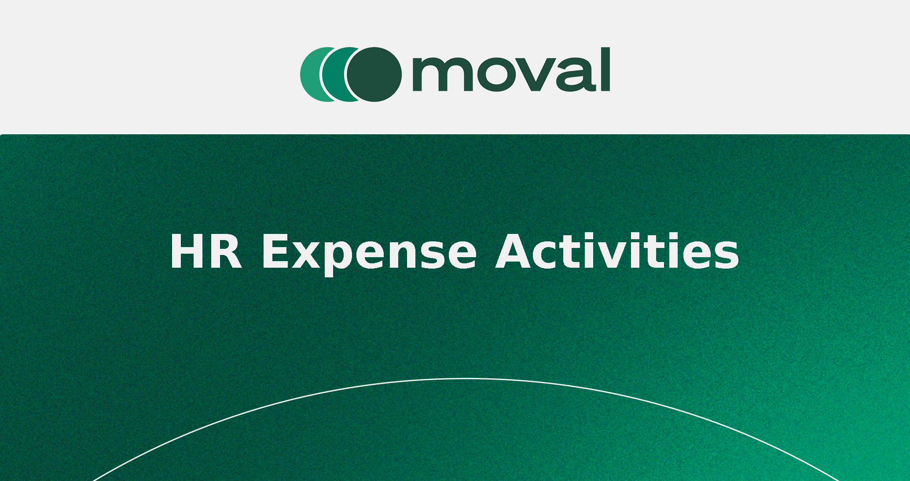

.. image:: https://img.shields.io/badge/licence-AGPL--3-blue.svg
    :target: http://www.gnu.org/licenses/agpl-3.0-standalone.html
    :alt: License: AGPL-3

======================
hr_expense_activities
======================

Overview
========
This module adds a system setting to control whether an *activity* is created when submitting new expenses.
When disabled, expense sheets are submitted without creating related activities; when enabled, Odoo’s native activity behavior is preserved.

- **Menu:** Settings → Human Resources
- **Setting:** “Create an activity for new expenses”
- **Technical key:** ``hr_expense_activities.with_activity`` (stored in ``ir.config_parameter``)

Compatibility
=============
- Odoo **18.0**

Dependencies
============
- ``hr_expense``

Installation
============
Install the module as usual from Apps. No special configuration is required beyond toggling the setting in **Settings → Human Resources**.

Configuration
=============
1. Go to **Settings → Human Resources**.
2. Enable or disable **Create an activity for new expenses**.
3. Save your changes.

Usage
=====
- With the setting **enabled**: expense submission follows Odoo’s standard flow (activities may be created).
- With the setting **disabled**: expense sheets move to the *Submitted* state without creating activities.

Technical Details
=================
- The boolean setting is persisted via the config parameter:

  - Key: ``hr_expense_activities.with_activity``
  - Type: stringified boolean in ``ir.config_parameter`` (handled transparently by field ``config_parameter`` or cast with ``str2bool`` in Python code).

- Views:
  - ``views/res_config_settings_views.xml`` adds the field to the Settings UI.

- Python:
  - ``res.config.settings`` contains the boolean field bound to the config parameter.
  - ``hr.expense.sheet`` overrides submission to honor the setting.

Uninstallation
==============
No data is left behind beyond the ``ir.config_parameter`` key, which is harmless if it remains.

Screenshots
===========

Bug Tracker
===========
If you find a bug or have a feature request, please open an issue with steps to reproduce and your Odoo version, or contact support:

- Email: soporte@moval.es

Credits
=======

Contributors
------------
* Alberto Hernández <ahernandez@moval.es>
* Eduardo Iniesta <einiesta@moval.es>
* Jesús Martínez <jmartinez@moval.es>
* Miguel Mora <mmora@moval.es>
* Juanu Sandoval <jsandoval@moval.es>
* Salvador Sánchez <ssanchez@moval.es>
* Jorge Vera <jvera@moval.es>

Maintainer
----------
.. image:: https://services.moval.es/static/images/logo_moval_small.png
   :target: http://moval.es
   :alt: Moval Agroingeniería

This module is maintained by **Moval Agroingeniería**.
